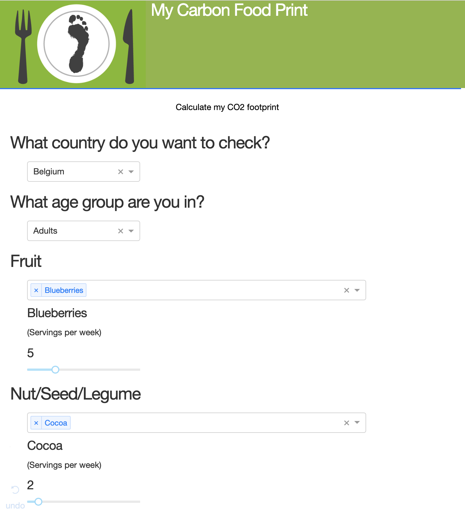
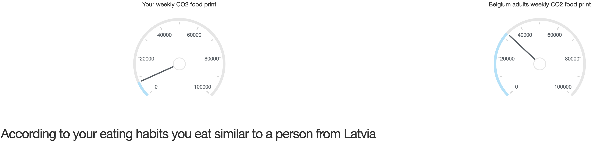
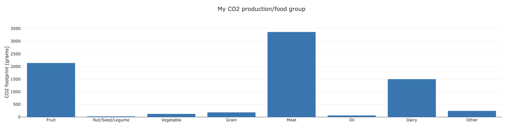
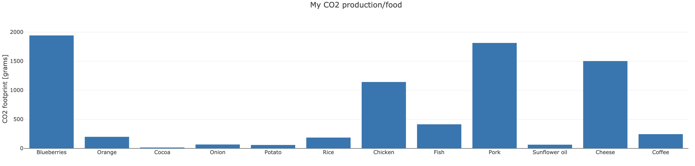
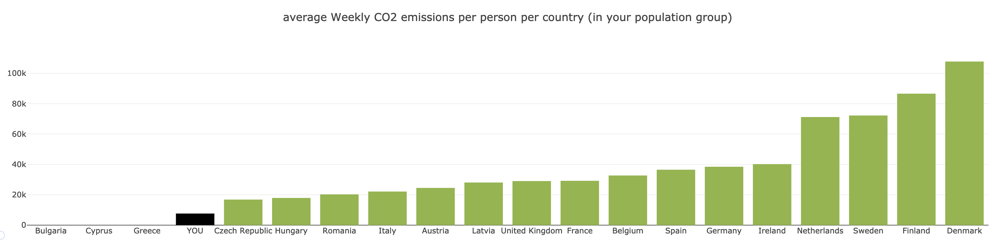
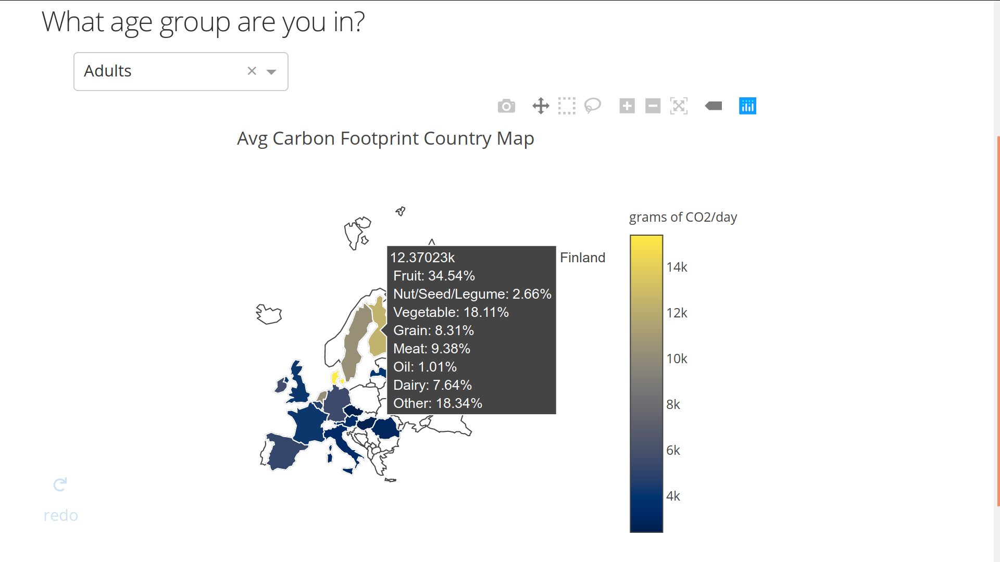

# MyCarbonFoodPrint Project

_This project was developed as part of the [Datathon'19](http://datathon.cs.kuleuven.be/) competition, organized by the KU Leuven. Our team was rewarded as 2nd best Master team and 1st best Modelling team of the event._

The competition consisted of analysing one of two different data sets and developing a prototype application/business solution. The data set selected for the analysis was the EFSA Comprehensive European Food Consumption (available on the the ./food_dataset folder). The app was developed in about 24 hours, by 5 group members.


## The app

The goal of this web app is to give the user the possibility to know how much CO2 they are emitting given their input diet, as well as analyzing the CO2 emissions of several countries given their food consumption.

The user is asked for the country they want to be compared with, their age group and the amount of serves per week they consume for a wide variety of food items. Their Carbon Food Print is calculated based on these inputs and a comparison with the country and age group they selected is shown.



The image below corresponds to the comparison of the user's CO2 emissions and the average of the country he selected.



The 2 images below show the user's CO2 emissions split by category and food item, respectively.





The below image presents the user's CO2 emissions compared to the average of other countries.



Below is shown a map with the different CO2 emissions per country based on dietary preferences by age group.




## Technology

This web app is developed in [Dash](https://plot.ly/products/dash/), which is a Python framework for building analytical web applications without the need of Javascript.


## Deployment

In order to deploy the app on the browser, first download the required packages specified inside *requirements.txt* into a virtual environment. Then:

```
# From the project repository type
python main.py

# The app will be running on http://127.0.0.1:8050/

